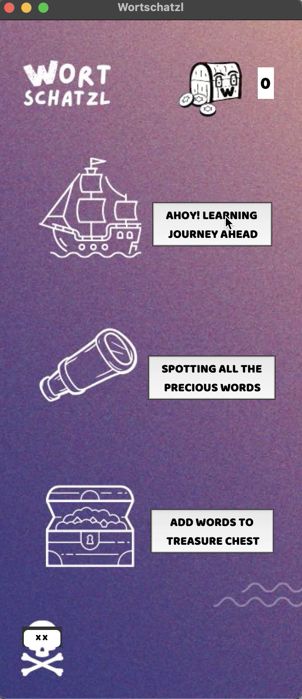

# max-schwendemann-tbii-exam-streamA

This repository contains my Tech Basics II Exam Project code. 


I have built a MVP for Wortschatzl - an app to learn, use and store beautiful German words:
When you run the `app.py` you are greeted with a homepage, which has three buttons that each lead to a subpage of the app. Depending on which button you choose you can either:
- Start you learning journey immediately by getting two nice German words you have to build a sentence with. Every time you get the spelling right you get a coin. The practice makes the words stick in your head.
- Have a look at the words that are already part of your word treasure chest "Wortschatzl".
- Add new words that inspire or amuse you to the "Wortschatzl" so you can learn and remember them later.



---
## Instructions to run my GUI

1. Clone my repository in a location of your choice
```
git clone https://github.com/schwendemann/max-schwendemann-tbii-exam-streamA.git
```
2. You should access my repository in your directory. You can change the directory in your terminal to where the cloned code is located.

3. If you have activated a virtual environment, or it is your first time working with these libraries, you will need to install tkinter and [pillow](https://pypi.org/project/pillow/):


Mac:
```
pip3 install tk pillow
```
Windows:
```
pip install tk pillow
```

4. Run the code

Mac:
```
python3 app.py
```
Windows:
```
python app.py
```
